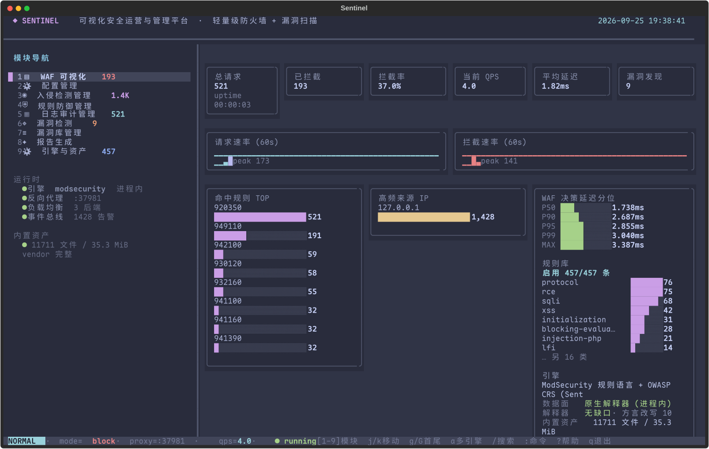
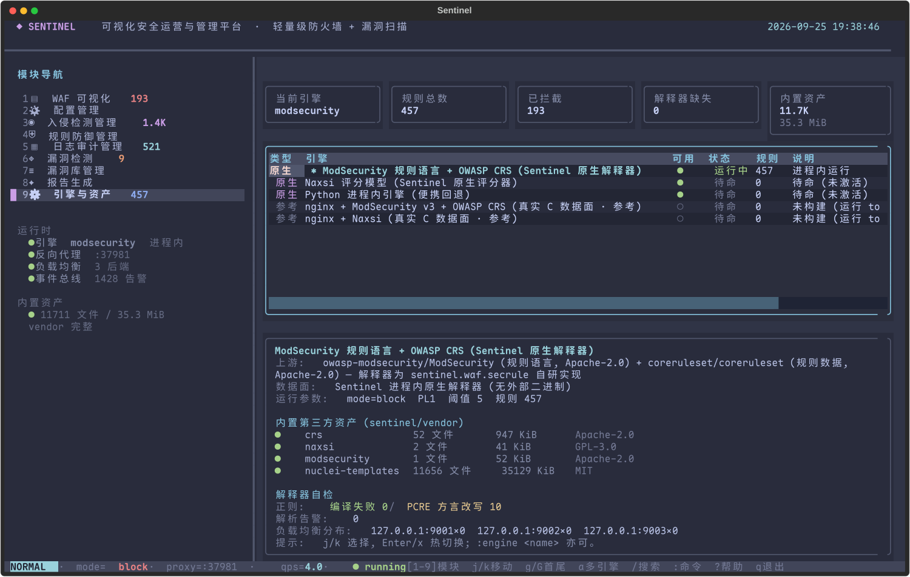

# Sentinel · Security Operations & Management Console

> Lightweight firewall + vulnerability scanning subsystem + a Vim-keyed TUI
> — **the engines, the rule-language interpreter and the template interpreter are all code in this repo**.

Sentinel shells out to no security binaries. It interprets the ModSecurity rule
language itself and executes real OWASP CRS rules, implements Naxsi's scoring
model, interprets nuclei's YAML templates, and implements its own active-scan
plugins. Third-party **data** (rules, templates, mapping tables) is pulled into
`sentinel/vendor/` once by `tools/vendor.py`; nothing is read from a sibling
directory at runtime.

```
                    ┌────────────────────────────────────────────────┐
                    │  Component III · Security Operations Console   │
                    │  sentinel.tui  ·  Textual + Catppuccin Frappé  │
                    └───────────────┬────────────────────────────────┘
              ┌─────────────────────┴──────────────────────┐
              ▼                                            ▼
 ┌───────────────────────────┐             ┌──────────────────────────────┐
 │ Component II · WAF        │             │ Component I · Vuln Scanner   │
 │ sentinel.waf              │             │ sentinel.scanner             │
 │  parse → normalize →      │             │  recon → detect → vulndb →   │
 │  rules → block            │             │  report                      │
 │  ▸ SecRule interpreter    │             │  ▸ template interpreter      │
 │  ▸ Naxsi scorer           │             │  ▸ plugin scanner            │
 │  ▸ builtin rule set       │             │  ▸ builtin detectors (10)    │
 └───────────┬───────────────┘             └───────────────┬──────────────┘
             └──────────────────┬──────────────────────────┘
                                ▼
                ┌──────────────────────────────────┐
                │ Backend lab  ·  sentinel.lab     │
                │ multi-instance, intentionally    │
                │ vulnerable (SQLi/XSS/SSRF/LFI)   │
                └──────────────────────────────────┘
```

<sub>`Component I / II / III` are the three required parts of the course project
this was built for (scanner / firewall / management console); they map 1:1 onto
`sentinel.scanner` / `sentinel.waf` / `sentinel.tui`.</sub>

## Contents

- [Design notes: from calling to implementing](#design-notes-from-calling-to-implementing)
- [Architecture mapping](#architecture-mapping)
- [Vendored third-party assets](#vendored-third-party-assets)
- [Quick start](#quick-start)
- [The TUI](#the-tui)
- [Keybindings and commands](#keybindings-and-commands)
- [Tests and benchmarks](#tests-and-benchmarks)
- [Project layout](#project-layout)

## Design notes: from calling to implementing

The early version treated `nginx + libmodsecurity` and the `nuclei` binary as
black boxes to "drive": Sentinel generated config, supervised the process and
tailed the logs. That works, but **your ceiling becomes the upstream's ceiling** —
and the moment a sibling directory is renamed, you move machines, or a Go binary
goes missing, the whole platform fails silently.

That capability now lives in this repo. Three pieces matter most:

### 1. ModSecurity rule-language interpreter (`sentinel/waf/secrule/`)

It parses `SecRule` / `SecAction` / `SecDefaultAction` / `SecMarker` itself, and
implements the variable space (`ARGS` / `REQUEST_HEADERS` / `TX` / …), operators
(`@rx` / `@pmFromFile` / `@detectSQLi` / `@ge` / …), transforms (`t:urlDecodeUni` /
`t:cmdLine` / …) and actions (`setvar` / `ctl` / `chain` / `skipAfter` /
`capture`). Then it loads the **real OWASP CRS rules** from `sentinel/vendor/crs`:

```python
from sentinel.core.config import Config
from sentinel.waf.engines import ModSecurityEngine

driver = ModSecurityEngine(Config())      # loads 457 request-side CRS rules (phases 1/2)
decision = driver.inspect(request)        # -> Decision(verdict/score/matched_rules)
```

The ModSecurity rule language has a set of **counter-intuitive semantics that
fail silently**. Each one was matched against the C implementation and pinned
down with a regression test (see `tests/test_secrule.py` and
`sentinel/waf/secrule/syntax.py`):

| Semantics | The intuitive reading | What it actually does |
| --- | --- | --- |
| `@validateByteRange` / `@validateUtf8Encoding` / `@validateUrlEncoding` | matches when valid | **matches when validation FAILS** |
| `&TX:x` | reads the variable | reads the **match count** (0 when unset) |
| `A\|!A:x` | negates A:x | **removes** A:x from the accumulated set |
| `block` under `SecDefaultAction "…,pass"` | blocks | **scores only**; the block comes from `REQUEST-949`'s `deny` |
| Paranoia Level | filters the rule set | **level-gated jumps** via `skipAfter` + `SecMarker` |
| `TX` key case | significant | **insensitive** (CRS writes `tx.` and reads `TX.`) |

PCRE-vs-Python-`re` dialect gaps are handled too (`\x{bf}`, `(?|…)`, `[\--9]`,
mid-pattern `(?i)`), and those rewrites **only kick in when Python fails to
compile the pattern** — so rules that were already correct are never touched.
The engine reports the rewrite count honestly:

```
interpreter self-check   regex: 0 compile failures / 10 PCRE dialect rewrites
```

### 2. Naxsi scorer (`sentinel/waf/naxsi/`)

Naxsi's model is nothing like ModSecurity's, so it gets its own implementation:
it parses `MainRule`'s `mz:` (inspection surfaces) and `s:$SQL:4` (per-key
scoring), and decides against `CheckRule` thresholds. 46 core rules across 6
score keys, with thresholds tightening from PL1 to PL4.

### 3. nuclei template interpreter (`sentinel/scanner/templating/`)

It parses and executes nuclei's YAML templates itself: `method` / `path` / `raw` /
`headers` / `body` / `payloads` / `attack` (sniper · pitchfork · clusterbomb ·
batteringram), matchers (status · size · word · regex · binary · dsl), extractors
(regex · kval · json · dsl), `{{...}}` interpolation and DSL functions. The
template data is the official `nuclei-templates` (11,309 HTTP templates vendored).

The DSL is evaluated with an `ast` whitelist rather than `eval` — templates come
from a third-party repo, and executing them would hand over arbitrary code
execution (`tests/test_templating.py` has the rejection cases).

**Only the targets you asked for are scanned.** Official templates include a
number of SSRF/OAST probes with external hosts hard-coded into `path`
(`169.254.169.254`, `*.oast.pro`, `generativelanguage.googleapis.com` …). By
default only the hosts being scanned are reachable; everything else is skipped
and counted (visible as `blocked_external` in the scan panel). That both keeps
the scanner from quietly contacting third parties and removes a 5-second timeout
each — the same scan went from **87 s to 1.5 s**. Opt out with
`NucleiEngine(allow_external=True)`.

## Architecture mapping

| Layer | Subsystem | Package | Responsibility |
| --- | --- | --- | --- |
| Component I | Vulnerability scanner | `sentinel/scanner/` | recon → detection → vuln DB / rule engine → reporting |
| Component II | Lightweight firewall | `sentinel/waf/` | HTTP parsing → normalization → signatures/rules → blocking & audit |
| Component III | Operations & management console | `sentinel/tui/` | dashboard / config / IDS / rules / audit / engines & assets |
| Backend | Vulnerable web lab | `sentinel/lab/` | multi-instance lab with ten planted vulnerability classes |

## Vendored third-party assets

Third-party **data** (not code) is pulled from upstream into `sentinel/vendor/`
by `tools/vendor.py`, with a per-file SHA-256 and license recorded:

| Collection | Upstream | License | Size | Purpose |
| --- | --- | --- | ---: | --- |
| `crs/` | coreruleset/coreruleset | Apache-2.0 | 52 files | OWASP CRS rules and data files |
| `naxsi/` | nbs-system/naxsi | GPL-3.0 | 2 files | `naxsi_core.rules` |
| `modsecurity/` | owasp-modsecurity/ModSecurity | Apache-2.0 | 1 file | `unicode.mapping` |
| `nuclei-templates/` | projectdiscovery/nuclei-templates | MIT | 11,656 files | HTTP templates and wordlists |

```bash
python tools/vendor.py            # re-sync from upstream
python tools/vendor.py --check    # verify the manifest matches disk (for CI)
```

`tests/test_vendor.py` guards the boundary: **no `waf_pro` / `digger_pro` path may
reappear in runtime code**.

## Quick start

You need `mise` and `uv` — **no C toolchain, no Go**:

```bash
git clone https://github.com/NonMirror/sentinel.git
cd sentinel
mise install            # toolchain (Python 3.14 + uv)
mise run install        # uv sync --extra test --extra report
mise run test           # unit + integration + end-to-end tests
mise run tui            # launch the console
```

The WAF and the scanner work out of the box: the rules and templates are already
in `sentinel/vendor/`.

**Optional:** build the real nginx + ModSecurity / Naxsi data plane as a
**reference implementation** for cross-checking the interpreter's semantics.
Skipping this changes nothing functionally:

```bash
mise run build:engines  # tools/build_engines.sh -> sentinel/build/
```

Common tasks:

| Task | What it does |
| --- | --- |
| `mise run test` | full test suite |
| `mise run test:fast` | fast unit tests only (skips `slow`) |
| `mise run junit` | run tests, write `reports/junit.xml` |
| `mise run bench` | quality/throughput benchmarks → `reports/bench-*.json` / `.md` |
| `mise run report` | benchmarks + the Chinese-language report (MD/HTML/DOCX) |
| `mise run shot` | regenerate `docs/tui/*.png` screenshots |
| `mise run lab` | lab + WAF reverse proxy, no TUI |
| `mise run lint` | syntax and import self-check |
| `mise run vendor` | re-sync `sentinel/vendor/` |

## The TUI

Everything uses the **Catppuccin Frappé** palette (`#303446` base / `#8caaee`
accent, matching `catppuccin-frappe.theme`). Screenshots are regenerated by
`mise run shot`.





<sub>Left: live posture (request rate / block rate / top-hit rules / decision
latency percentiles). Right: engines and vendored assets — the native
interpreter, each collection's provenance and license, and the interpreter
self-check (regex compile failures / PCRE dialect rewrites).</sub>

| Module | Name | Component |
| --- | --- | --- |
| `1` | WAF dashboard (live QPS / block rate / top rules / latency percentiles) | III |
| `2` | Configuration (listener, mode, threshold, PL, LB strategy) | III |
| `3` | Intrusion detection (per-event verdicts, matched rules, source profiling) | II |
| `4` | Rule management (enable/disable, export ModSecurity / Naxsi syntax) | II |
| `5` | Audit log (structured audit stream, `dd` to freeze the view) | II |
| `6` | Vulnerability scanning (single engine / multi-engine fusion) | I |
| `7` | Vulnerability DB (plugins, OWASP/CWE mappings) | I |
| `8` | Reporting (Markdown / HTML / JSON) | I |
| `9` | Engines & assets (native interpreters · vendored rules/templates · optional C data plane) | II |

The sidebar carries live badges (blocks / alerts / findings / rules) and is
clickable; module 9 shows both **each asset's provenance and license** and the
**interpreter self-check** (regex compile failures, dialect rewrites).

## Keybindings and commands

Vim-style:

| Key | Action | Key | Action |
| --- | --- | --- | --- |
| `1`–`9` | switch module | `j` / `k` | down / up |
| `gg` / `G` | first / last line | `h` / `l` | focus left / right |
| `Enter` | activate / switch engine | `x` / `Space` | toggle rule / switch engine |
| `dd` | clear / freeze the current view | `yy` | yank the current row |
| `/` | filter | `:` | command mode |
| `r` | refresh / reload | `s` / `D` | normal / deep scan |
| `a` / `A` | multi-engine / multi-engine deep scan | `Tab` | next module |
| `?` | help overlay | `q` | quit |

<sub>`j`/`k` act on the current panel: a table with rows moves its cursor,
otherwise the live log scrolls. In a log, `k` pauses auto-follow and `G` returns
to the last line and resumes it. When a panel has nothing to move, the status bar
says why instead of swallowing the key.</sub>

Command mode:

```
:w                              save config to sentinel.toml
:set mode=block|detect|off      :set threshold=3..30   :set pl=1..4
:set rate=0..200                :set strategy=round_robin|least_conn|random|ip_hash
:engine [name]                  show / hot-swap the WAF engine
:vendor                         vendored asset provenance and integrity
:scan [url]  :scan! [url]       scan / deep scan
:scanall [url]  :scanall! [url] multi-engine fused scan
:report [md|html|json]  :export write a report / export the current engine's rules
:reload  :clear
```

Engines:

| Engine | Kind | Description |
| --- | --- | --- |
| `modsecurity` | native (default) | Sentinel SecRule interpreter + OWASP CRS |
| `naxsi` | native | Sentinel Naxsi scorer + core rules |
| `python` | native | Sentinel's builtin lightweight rule set |
| `nginx-modsecurity` | reference (optional) | real nginx + libmodsecurity, for semantic cross-checking |
| `nginx-naxsi` | reference (optional) | real nginx + Naxsi C module, same purpose |

## Project layout

```
sentinel/
├── sentinel/
│   ├── waf/            Component II
│   │   ├── secrule/    ★ ModSecurity rule-language interpreter (syntax·variables·transforms·operators·engine)
│   │   ├── naxsi/      ★ Naxsi rule parser and scorer
│   │   ├── engines/    engine drivers: native (modsecurity·naxsi·python) + reference (nginx-*)
│   │   └── ...         parser / transforms / signatures / rules / proxy / balancer / IDS
│   ├── scanner/        Component I
│   │   ├── templating/ ★ nuclei YAML template interpreter (model·expression·matchers·runner·engine)
│   │   ├── plugins/    ★ plugin-based active scanning (design modelled on w13scan)
│   │   └── ...         crawler / detectors / vuln DB / multi-engine fusion / reporting
│   ├── tui/            Component III
│   ├── lab/            backend lab (multi-instance)
│   ├── core/           config / event bus / metrics / audit / data models
│   ├── vendor/         vendored third-party assets (generated by tools/vendor.py)
│   └── reporting.py    Chinese-language test report (MD / self-contained HTML / DOCX)
├── benchmarks/         corpus + benchmarks (quality / throughput / QPS / trade-off curves)
├── tools/              vendor.py · build_engines.sh · capture_tui.py
├── templates/nuclei/   purpose-built lab PoC templates
├── tests/              unit / integration / end-to-end tests
└── docs/tui/           TUI screenshots (PNG + SVG)
```

## Tests and benchmarks

- **Tests**: `mise run test` — **591 passing, 0 failing** (9 real-nginx cases
  auto-skip when the reference data plane isn't built). Details in
  `reports/junit.xml` and the report's test-case matrix. Much of the interpreter
  suite (`tests/test_secrule.py`, `test_naxsi.py`, `test_templating.py`) is
  frozen bugs, e.g. "`@validateByteRange` matches on failure" and "`&TX:x` reads
  a count".
- **Corpus**: `benchmarks/corpus.py` builds **178** raw HTTP/1.1 messages
  (75 benign + 103 attacks: SQLi / XSS / RCE / LFI / SSRF / scanner / protocol /
  recon). The benign set deliberately includes attack-looking text
  (`select the best laptop`, `union station opening hours`) to test precision.
- **Quality**: scored by **raw-message replay** (method, headers and body
  preserved), reporting TP/FP/TN/FN, precision, recall, F1, false-positive rate
  and per-category detection rate.
- **Performance**: parser throughput, interpreter decision throughput, proxy
  end-to-end latency, load-balancer evenness, template interpreter throughput,
  rule load time.
- **Trade-offs**: Paranoia Level (PL1–PL4) and anomaly-threshold sweeps.
- **Cross-check**: the real `nginx + ModSecurity` data plane (if built) runs the
  **same CRS rules** as the native interpreter, to validate semantics.

### Latest measured run (2026-09-25, Python 3.14.7)

Native engine, raw-message replay over the 178-message corpus:

| Engine | Precision | Recall | F1 | FP | FN |
| --- | ---: | ---: | ---: | ---: | ---: |
| `modsecurity` (native SecRule interpreter + OWASP CRS, PL1) | **100.0%** | 89.3% | **94.4%** | 0 | 11 |
| Earlier nginx + libmodsecurity data plane (baseline) | 90.3% | 90.3% | 90.3% | 10 | 10 |

The native interpreter has **zero false positives**: benign look-alikes such as
`select the best laptop`, `union station opening hours` and `order by popularity`
all pass. Per-category detection:

| Category | Detected | Category | Detected |
| --- | ---: | --- | ---: |
| XSS | 22/22 (100%) | SSRF | 9/10 (90%) |
| LFI | 11/11 (100%) | RCE | 9/11 (82%) |
| SQLi | 27/28 (96%) | protocol | 1/2 (50%) |
| scanner fingerprints | 11/12 (92%) | recon paths | 2/7 (29%) |

The default is **PL1** — raising the Paranoia Level costs far more than it buys
(same corpus, threshold 5):

| PL | Precision | Recall | F1 | FP | FN |
| ---: | ---: | ---: | ---: | ---: | ---: |
| **1 (default)** | **100.0%** | 89.3% | **94.4%** | **0** | 11 |
| 2 | 95.0% | 92.2% | 93.6% | 5 | 8 |
| 3 | 92.2% | 92.2% | 92.2% | 8 | 8 |
| 4 | 73.3% | 93.2% | 82.1% | 35 | 7 |

"Recon paths" is the one category no PL fixes (`/phpmyadmin`, `/actuator/env`,
`/wp-login.php`): CRS is about **request-side attack signatures**, while path
reconnaissance is asset discovery. Those targets are covered by the scanner
subsystem's builtin detectors and plugin engine (the fused multi-engine scan
reports them) — which is precisely why the WAF and the scanner live on the same
platform.

The interpreter itself costs about **2.6 ms/request** (391 req/s single-threaded)
and loads 457 rules in ~0.2 s; the nginx+ModSecurity data plane measured 5.66 ms
(P50) for comparison — same order of magnitude.

> All figures regenerate on every `mise run bench`; see `reports/bench-*.json` and
> `reports/report-*.html` (self-contained, with charts and screenshots embedded).

## Disclaimer

This project is for teaching and for authorised security testing. Do not scan or
attack targets you do not have permission to test. The vendored third-party rules
and templates remain under their original licenses — see
`sentinel/vendor/README.md`.
